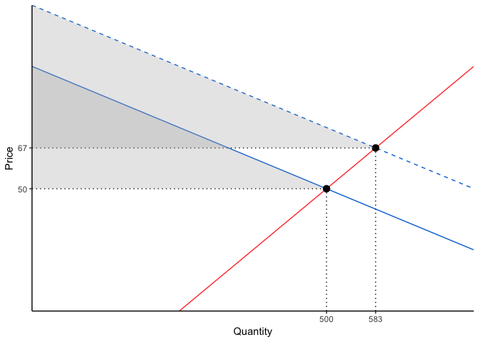

# What is it?

`ggsupplyDemand` is a package that makes it extremely easy to plot supply and demand with ggplot2.


```r
library(ggsupplyDemand)

create_supply_and_demand() %>% 
  shift_demand(outwards = TRUE) %>% 
  plot_supply_and_demand()
```

<!-- -->
