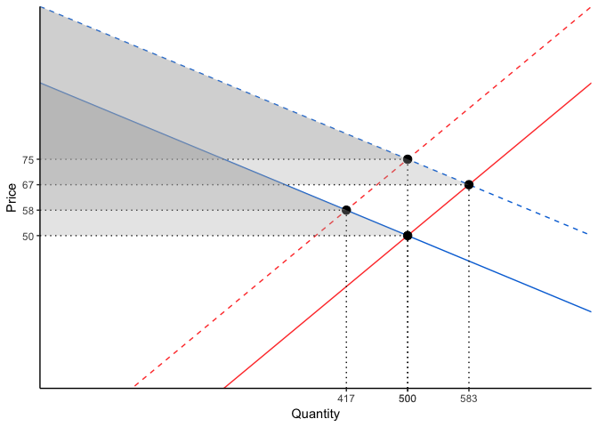
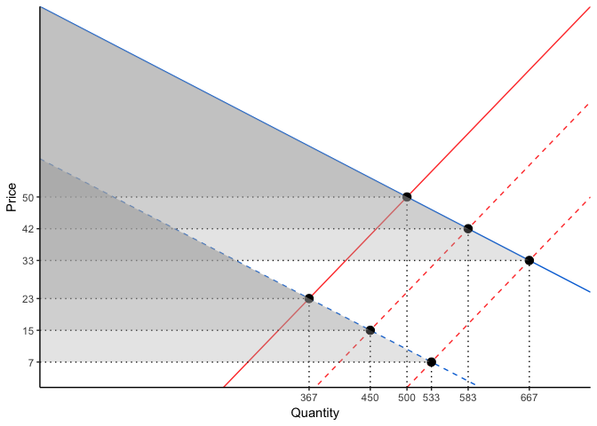

# What is it?

`ggsupplyDemand` is a package that makes it extremely easy to plot supply and demand systems with `ggplot2`.


```r
library(ggsupplyDemand)

create_supply_and_demand() %>% 
  shift_demand(outwards = TRUE) %>% 
  plot_supply_and_demand(consumer_surplus = TRUE)
```

<!-- -->

# Acknowledgment

`ggsupplyDemand` wouldn't exist without [Andrew Heiss](https://www.andrewheiss.com) from Brigham Young University and his [post](https://www.andrewheiss.com/blog/2017/09/15/create-supply-and-demand-economics-curves-with-ggplot2/) doing most of the heavylifting that `ggsupplyDemand` leverages. 

# Install it!


```r
if (!require(devtools)) {
  install.packages("devtools")
}
devtools::install_github("David-Salazar/ggsupplyDemand")
```

# How does it work?

Build step-by-step a `tibble` that represents a system of supply and demand. Use `create_supply_and_demand()` and `shift_demand()`, `shift_supply()`.


```r
create_supply_and_demand() %>% 
  shift_demand(outwards = TRUE) %>% 
  shift_supply(outwards = FALSE) %>% 
  plot_supply_and_demand(consumer_surplus = TRUE)
```

<!-- -->

`ggsupplyDemand` has a default shifter for both the demand and supply. However, if you need something different, you can always change it:


```r
create_supply_and_demand() %>% 
  shift_supply() %>% 
  shift_supply(shifter = 250) %>% 
  shift_demand(outwards = FALSE, shifter = 400) %>% 
  plot_supply_and_demand()
```

<!-- -->


